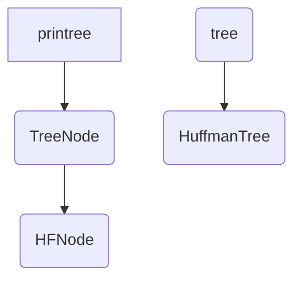

#              树，哈夫曼树类型的实现和应用

## 摘要

本md文件主要用于该java项目的代码解释和说明，该项目包含的内容有：

1. 树类和结点类的构造，树的前中后序遍历。
2. 哈夫曼树类和哈夫曼结点的构造，哈夫曼树的前中后序遍历。
3. 打印树。

主要包含的类：

|    class    |                             解释                             |
| :---------: | :----------------------------------------------------------: |
|  TreeNode   |                            结点类                            |
|    tree     |                             树类                             |
|   HFNode    |                 哈夫曼结点类继承自TreeNode类                 |
| HuffmanTree |                     哈夫曼树类继承自树类                     |
|   Treerun   | 包含main函数在内，主要用于申请对象，然后调用其他的类来实现程序运行 |

对象之间的关系：

（正方形代表接口，半圆方形代表对象）




## 详叙

### class tree

class tree中包含TreeNode参数以及树的构造方法。

```java
class tree  {
	TreeNode node;

	public tree(TreeNode A) {
		node = A;
	}
	public tree() {
		TreeNode node=null;
		this.node=node;
	}
/*
 * 新建一棵树
 *        A 
 *      /   \
 *     B     C
 *   /   \     \
 *  D     E     F
 */
	public static void treecreate(TreeNode A) {
		TreeNode B = new TreeNode(2, "B");
		TreeNode C = new TreeNode(3, "C");
		TreeNode D = new TreeNode(4, "D");
		TreeNode E = new TreeNode(5, "E");
		TreeNode F = new TreeNode(6, "F");
	
		A.setLeftChild(B);
		A.setRightChild(C);
		B.setLeftChild(D);
		B.setRightChild(E);
		C.setRightChild(F);
```


### class TreeNode

结点类包括key值（即标记），data，以及左右子结点。

方法包括结点的构造，高度和结点总数的计算以及结点的遍历（前中后序）方法。

```java
class TreeNode implements Printree{
	private int key;
	private String data;
	private TreeNode leftchild;
	private TreeNode rightchild;
/*
 * 结点的构造方法分为三种:
 * 1.只输入键值和数据 此时子结点均为空
 * 2.输入键值和数据以及左右结点
 * 3.什么都不输入默认key值为1 数据为空 没有左右子结点
 */
	public TreeNode(int key, String data) {
		this.key = key;
		this.data = data;
		this.leftchild = null;
		this.rightchild = null;
	}

	public TreeNode(int key, String data, TreeNode leftchild, TreeNode rightchild) {
		this.key = key;
		this.data = data;
		this.leftchild = leftchild;
		this.rightchild = rightchild;
	}

	public TreeNode() {
		this(1, null);
	}
/*
 * set方法修改结点的左子结点和右子节点
 */
	public void setLeftChild(TreeNode node) {

		this.leftchild = node;

	}

	public void setRightChild(TreeNode node) {
		this.rightchild = node;
	}
	/*
	 * get方法 获取该结点对象的数据，key值以及左右子节点值
	 */
	public String getdata() {
		return this.data;
	}
	public int getkey() {
		return this.key;
	}
	public TreeNode getleftchild() {
		return this.leftchild;
	}
	public TreeNode getrightchild() {
		return this.rightchild;
	}
	
/*
 * show方法输出当前对象的key值和data值
 * 也为之后的递归算法做准备
 */
	public void show() {
		System.out.println("key:" + key + "--data:" + data);
	}
/*
 * 递归算法计算结点的高度（层数）
 * 当左子结点或者右子节点为空时 高度（层数）为1
 * 当左子结点不为空，右子结点不为空时
 * 高度（层数）为较大子结点高度+1
 * 
 */
	public int height() {
		int i = 0;
		int j = 0;
		if(this.leftchild==null&&this.rightchild==null) {
			return 1;
		}
		if (this.leftchild != null) {
			i = this.leftchild.height();
		}
		if (this.rightchild != null) {
			j = this.rightchild.height();
		}
		return (i < j) ? (j + 1) : (i + 1);

	}
/*
 * 递归求解结点的总数
 * 当结点为空时 节点总数为0
 * 当结点非空时，结点总数为左子结点总数+右子结点总数+根结点数（1）
 */
	public int size(TreeNode T) {
		if (T == null) {
			return 0;
		} else {
			return 1 + size(T.leftchild) + size(T.rightchild);
		}
	}
/*
 * 递归算法实现前序遍历
 * 首先输出根结点的数据
 * 其次再遍历左子结点
 * 最后遍历右子结点
 * 中序遍历，后序遍历情况类似
 */
	public void preOrder() {
		this.show();
		if (this.leftchild != null) {
			this.leftchild.preOrder();
		}
		if (this.rightchild != null) {
			this.rightchild.preOrder();

		}

	}

	public void inOrder() {

		if (this.leftchild != null) {
			this.leftchild.inOrder();
		}
		this.show();
		if (this.rightchild != null) {
			this.rightchild.inOrder();

		}

	}

	public void postOrder() {

		if (this.leftchild != null) {
			this.leftchild.postOrder();
		}
		if (this.rightchild != null) {
			this.rightchild.postOrder();

		}
		this.show();
	}

	public void Copy(TreeNode T, TreeNode S) {
		if (T == null) {
			S = null;
		} else {
			S = T;
			Copy(T.leftchild, S.leftchild);

		}
	}

	@Override
	public String toString() {
		return "TreeNode [key=" + key + ", data=" + data + "]";
	}

}
```

### class HuffmanTree

HuffmanTree类继承自tree类 其中包含哈夫曼树的构造方法

buildHFtree方法主要思路： 
 * 输入一串数组（arr）使得该数组转化为哈夫曼树
 * 引入ArrayList动态数组 实现增删改查功能 
 * 然后将数组arr中的元素挨个添加进去 
 * 哈夫曼树的实现过程便是，对nodesList数组进行排序 
 * （利用Collections类中的sort方法进行升序排序）
 * 然后将排好序之后的数组的0号位和1号位视为左子结点和右子结点二者相加即为其父结点
 * 然后将左子结点和右子结点从nodesList数组中删除
 * 将父结点添入nodesList数组中再重新进行排序以及结点建立直到nodesList数组中没有元素为止，哈夫曼树即成功建立。


```java
class HuffmanTree extends tree {
	HFNode node;
	static HFNode buildHFtree(int[] arr) {
		ArrayList<HFNode> nodesList = new ArrayList<HFNode>();
		for (int x : arr) {
			nodesList.add(new HFNode(x,"A"));
		}
		while (nodesList.size() > 1) {
			Collections.sort(nodesList);
			HFNode leftNode = nodesList.get(0);
			HFNode rightNode = nodesList.get(1);
			HFNode parent = new HFNode(leftNode.Getweight() + rightNode.Getweight()," ",leftNode,rightNode);
			parent.setLeftChild(leftNode);
			parent.setRightChild(rightNode);
			nodesList.remove(leftNode);
			nodesList.remove(rightNode);
			nodesList.add(parent);
		}
		return nodesList.get(0);
	}
}
```

### class HFNode

哈夫曼结点类继承自结点类，类开头接入Comparable接口 ,Comparable接口主要引入compareTo方法,比较对象权重和结点的权重。

```java
class HFNode extends TreeNode implements Printree, Comparable<HFNode> {
	private int weight;
	private String data;
	private HFNode leftchild;
	private HFNode rightchild;

	/*
	 * 构造huffman树的三种方法 
	 * 1. 输入权重和数据 
	 * 2.默认构造法 权重为0 数据为空 
	 * 3.仅输入权重，数据为空
	 */
	public HFNode(int weight, String data) {
		this.data = data;
		this.weight = weight;
	}

	public HFNode() {
		this(0, " ");
	}
	public HFNode(int weight,String data,HFNode leftchild,HFNode rightchild) {
		this.weight=weight;
		this.data=data;
		this.leftchild=leftchild;
		this.rightchild=rightchild;
	}

	public HFNode(int weight) {
		this(weight, " ");
	}

	public int Getweight() {
		return this.weight;
	}
	

	@Override
	public HFNode getleftchild() {
		// TODO Auto-generated method stub
		return this.leftchild;
	}

	@Override
	public HFNode getrightchild() {
		// TODO Auto-generated method stub
		return this.rightchild;
	}

	@Override
	public String toString() {
		return "HFNode [weight=" + weight + "data"+ data +"]";
	}

	/*
	 * HFNode类开头接入Comparable接口 
	 * Comparable接口主要引入compareTo方法 
	 * 比较对象权重和结点的权重
	 */
	@Override
	public int compareTo(HFNode node) {
		// TODO Auto-generated method stub
		return this.weight - node.weight;
	}

	@Override
	public void show() {
		// TODO Auto-generated method stub
		System.out.println("weight:" + weight);
	}
	

}
```


### interface Printree

接入Printree接口 即可打印出树状图，其中包含静态方法writeArray()以及show()。

打印树状图的基本思路为：

 * 首先，先确定树的形状.
 * 设定在最后一行的每个数字之间的间隔为3个空格，
 * 而在之上的每一层的间隔，越往上，间隔是越大的，而且是一个简单的线性增加的关系。
 * 为了绘制出这样的形状，首先，我们需要获得树的层数，（用一个简单的递归即可得到。
 * 根据树的层数，确定我们的二维数组的大小，即高度和宽度。
 * 之后，用先序遍历的方式，遍历树的每个结点，并进行相对应的写入操作。

该接口包含了树的打印方法和哈夫曼树的打印方法

树的打印方式是打印了树的data值，而哈夫曼树的打印方式则是打印其权重值。

```java
interface Printree {
	public static void writeArray(TreeNode node, int rowIndex, int colIndex, 
			String[][] res, int Depth) {
		/*
		 * 获取结点的key值以及左右子结点
		 */
		//int key = node.getkey();
		String data=node.getdata();
		TreeNode leftchild = node.getleftchild();
		TreeNode rightchild = node.getrightchild();
		/*
		 * 如果结点为空
		 * 直接返回
		 */
		if (node == null) {
			return;
		}
		/*
		 * 将key值转换为字符串赋值给res数组
		 */
		//res[rowIndex][colIndex] = String.valueOf(key);
		res[rowIndex][colIndex]=String.valueOf(data);
		/*
		 * 计算当前位于树的第几层
		 */
		int level = ((rowIndex + 1) / 2);
		if (level == Depth) {
			return;
		}
		/*
		 *  计算当前行到下一行，每个元素之间的间隔
		 * （下一行的列索引与当前元素的列索引之间的间隔）
		 */
		int gap = Depth - level - 1;
		/*
		 * 对左子结点进行判断，若有左子结点，则记录相应的"/"与左子结点的值
		 * 
		 */
		if (leftchild != null) {
			res[rowIndex + 1][colIndex - gap] = "/";
			writeArray(leftchild, rowIndex + 2, colIndex - gap*2 , res, Depth);
		}
		/*
		 * 对右子结点进行判断，若有右子结点，则记录相应的"\"与右子结点的值
		 */
		if (rightchild != null) {
			res[rowIndex + 1][colIndex + gap] = "\\";
			writeArray(rightchild, rowIndex + 2, colIndex + gap*2, res, Depth);
		}
	}

	public static void show(TreeNode node) {
		if (node == null)
			System.out.println("EMPTY!");
		/*
		 * 计算树的深度（高度）
		 */
		int Depth = node.height();
		/*
		 * 计算二维数组的高度和宽度
		 * 最后一行的宽度为2的（n - 1）次方乘3，再加1
		 * 在数字没有溢出的前提下，对于正数和负数，
		 * 左移一位都相当于乘以2的1次方，左移n位就相当于乘以2的n次方。
		 */
		int arrayHeight = Depth * 2 - 1;
		int arrayWidth = (2 << (Depth - 2)) * 3 + 1;
		/*
		 * 引入二维数组res，默认元素均为" "
		 */
		String[][] res = new String[arrayHeight][arrayWidth];
		for (int i = 0; i < arrayHeight; i++) {
			for (int j = 0; j < arrayWidth; j++) {
				res[i][j] = " ";
			}
		}
		writeArray(node, 0, arrayWidth / 2, res, Depth);
		/*
		 * 引入StringBuilder数组，对打印出的字符串进行拼接。
		 * 以实现整体树的显示。
		 */
		for (String[] line : res) {
			StringBuilder test = new StringBuilder();
			for (int i = 0; i < line.length; i++) {
				test.append(line[i]);
				if (line[i].length() > 1 && i <= line.length - 1) {
					i += line[i].length() > 4 ? 2 : line[i].length() - 1;
				}
			}
			System.out.println(test.toString());
		}
	}
	/*
	 * 该writeArray方法以及show方法类似于前面两个 只是参数变为了HFNode,
	 * 同时数组判定从data变为了权重。
	 */
	public static void writeArray(HFNode node, int rowIndex, int colIndex, String[][] res, int Depth) {
		int weight = node.Getweight();
		HFNode leftchild = node.getleftchild();
		HFNode rightchild = node.getrightchild();
		if (node == null) {
			return;
		}
		res[rowIndex][colIndex] = String.valueOf(weight);
		int level = ((rowIndex + 1) / 2);
		if (level == Depth) {
			return;
		}
		int gap = Depth - level - 1;
		if (leftchild!=null) {
			res[rowIndex + 1][colIndex - gap] = "/";
			writeArray(leftchild, rowIndex + 2, colIndex - gap*2 , res, Depth);
		}
		if (rightchild!=null) {
			res[rowIndex + 1][colIndex + gap] = "\\";
			writeArray(rightchild, rowIndex + 2, colIndex + gap*2 , res, Depth);
		}
	}


	public static void show(HFNode node) {
		if (node == null)
			System.out.println("EMPTY!");
		int Depth = node.height();
		int arrayHeight = Depth * 2 - 1;
		int arrayWidth = (2 << (Depth - 2)) * 3 + 1;
		String[][] res = new String[arrayHeight][arrayWidth];
		for (int i = 0; i < arrayHeight; i++) {
			for (int j = 0; j < arrayWidth; j++) {
				res[i][j] = " ";
			}
		}
		writeArray(node, 0, arrayWidth / 2, res, Depth);
		for (String[] line : res) {
			StringBuilder test = new StringBuilder();
			for (int i = 0; i < line.length; i++) {
				test.append(line[i]);
				if (line[i].length() > 1 && i <= line.length - 1) {
					i += line[i].length() > 4 ? 2 : line[i].length() - 1;
				}
			}
			System.out.println(test.toString());
		}
	}
}

```

### class test

测试类 主要用于树对象的生成以及测试数据用。

```java
package runnnn;

import java.util.Scanner;

public class testfuc {
	public static void test() {
		TreeNode A = new TreeNode(1, "A");
		tree T = new tree(A);
		T.treecreate(A);
		System.out.println("打印该二叉树：");
		Printree.show(T.node);
		System.out.println("前序遍历：");
		T.node.preOrder();
		System.out.println("中序遍历：");
		T.node.inOrder();
		System.out.println("后序遍历：");
		T.node.postOrder();
		System.out.println("树的高度：" + T.node.height());
		System.out.println("树的结点数：" + T.node.size(T.node));
		System.out.println();
		// int[] arr= {1,2,3,4,5,6};
		// int[] arr = {3,7,8,29,5,11,23,14};
		// int arr[] = {13, 7, 8, 3, 29, 6, 1};
		System.out.println("输入数组的长度:");
		Scanner reader = new Scanner(System.in);
		int length = reader.nextInt();
		int[] arr = new int[length];
		System.out.println("输入哈夫曼树的权重数组：");
		for (int i = 0; i < length; i++) {
			arr[i] = reader.nextInt();
		}
		HFNode node = HuffmanTree.buildHFtree(arr);
		System.out.println("打印该哈夫曼树：");
		Printree.show(node);
		System.out.println("前序遍历：");
		node.preOrder();
		System.out.println("中序遍历：");
		node.inOrder();
		System.out.println("后序遍历：");
		node.postOrder();
		System.out.println();
		System.out.println("树的高度：" + node.height());
		System.out.println("树的结点数：" + node.size(node));
		}
	}


```


## 运行结果

```java
/*
打印该二叉树：
      A      
    /   \    
  B       C  
 / \       \ 
D   E       F
前序遍历：
key:1--data:A
key:2--data:B
key:4--data:D
key:5--data:E
key:3--data:C
key:6--data:F
中序遍历：
key:4--data:D
key:2--data:B
key:5--data:E
key:1--data:A
key:3--data:C
key:6--data:F
后序遍历：
key:4--data:D
key:5--data:E
key:2--data:B
key:6--data:F
key:3--data:C
key:1--data:A
树的高度：3
树的结点数：6

打印该哈夫曼树：
                        21                       
                    /       \                    
                9               12               
             /     \         /     \             
          4           5   6           6          
                                    /   \        
                                  3       3      
                                         / \     
                                        1   2    
前序遍历：
weight:21
weight:9
weight:4
weight:5
weight:12
weight:6
weight:6
weight:3
weight:3
weight:1
weight:2
中序遍历：
weight:4
weight:9
weight:5
weight:21
weight:6
weight:12
weight:3
weight:6
weight:1
weight:3
weight:2
后序遍历：
weight:4
weight:5
weight:9
weight:6
weight:3
weight:1
weight:2
weight:3
weight:6
weight:12
weight:21

树的高度：5
树的结点数：11


当arr数组为
int[] arr = {3,7,8,29,5,11,23,14}时


打印该哈夫曼树：
                        100                      
                    /       \                    
                42              58               
             /     \         /     \             
          19          23  29          29         
        /   \                       /   \        
      8       11                  14      15     
     / \                                 / \     
    3   5                               7   8    
前序遍历：
weight:100
weight:42
weight:19
weight:8
weight:3
weight:5
weight:11
weight:23
weight:58
weight:29
weight:29
weight:14
weight:15
weight:7
weight:8
中序遍历：
weight:3
weight:8
weight:5
weight:19
weight:11
weight:42
weight:23
weight:100
weight:29
weight:58
weight:14
weight:29
weight:7
weight:15
weight:8
后序遍历：
weight:3
weight:5
weight:8
weight:11
weight:19
weight:23
weight:42
weight:29
weight:14
weight:7
weight:8
weight:15
weight:29
weight:58
weight:100

树的高度：5
树的结点数：15


测试数据为：int arr[] = {13, 7, 8, 3, 29, 6, 1}时
打印该哈夫曼树：
                                                67                                               
                                           /         \                                           
                                      29                  38                                     
                                                      /       \                                  
                                                  15              23                             
                                               /     \         /     \                           
                                            7           8   10          13                       
                                                          /   \                                  
                                                        4       6                                
                                                       / \                                       
                                                      1   3                                      
前序遍历：
weight:67
weight:29
weight:38
weight:15
weight:7
weight:8
weight:23
weight:10
weight:4
weight:1
weight:3
weight:6
weight:13
中序遍历：
weight:29
weight:67
weight:7
weight:15
weight:8
weight:38
weight:1
weight:4
weight:3
weight:10
weight:6
weight:23
weight:13
后序遍历：
weight:29
weight:7
weight:8
weight:15
weight:1
weight:3
weight:4
weight:6
weight:10
weight:13
weight:23
weight:38
weight:67

树的高度：6
树的结点数：13

*/
```

